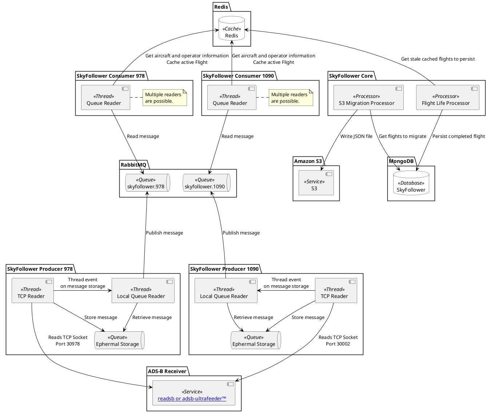
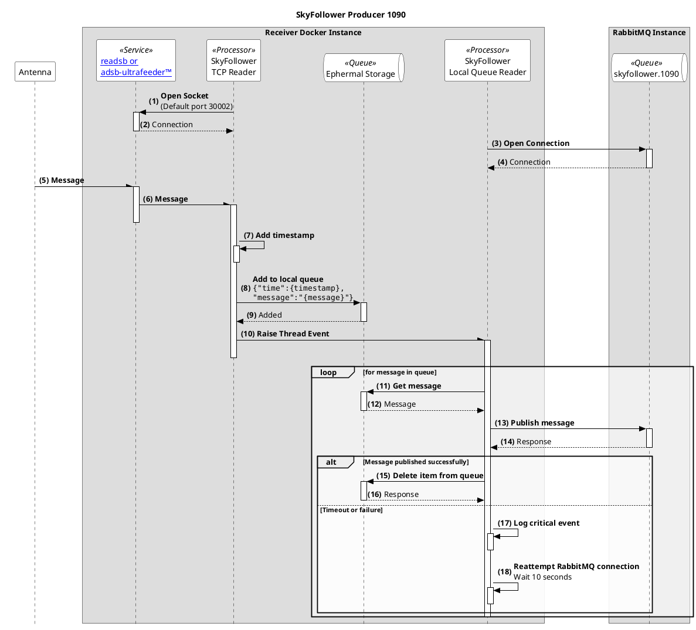

# SkyFollower Producer 1090

SkyFollower Producer 1090 deploys a TCP → RabbitMQ ADS-B data pipeline in Docker for 1090MHz.

SkyFollower Producer 1090 (`producer_1090.py`) connects to a TCP ADS-B source such as [readsb or adsb-ultrafeeder™](https://github.com/sdr-enthusiasts/docker-adsb-ultrafeeder) listening to a 1090MHz and forwards the raw data to RabbitMQ.

In the event the connection to RabbitMQ is unavailable, the Producer will 

---

## Prerequisites

Start with a fresh Raspberry Pi OS install.

You should install RabbitMQ on a separate system.

### Install Docker & Docker Compose

```bash
sudo apt update && sudo apt upgrade -y
sudo apt install -y git
```

Get Docker from their website:
```bash
curl -sSL https://get.docker.com | sh
```

Make curent user part of the docker group:
```bash
sudo usermod -aG docker $USER
```

Verify:
```bash
docker --version
docker-compose --version
```
---

Make the SkyFollower Folder
```bash
sudo mkdir /opt/SkyFollower
```

Change ownership so that docker can access it
```bash
sudo chgrp -R docker /opt/SkyFollower
```
```bash
sudo chmod -R g+w /opt/SkyFollower
```


## Deploy the Project

1. **Clone from GitHub:**
   ```bash
   git clone https://github.com/BrentIO/SkyFollower.git
   ```

2. **Modify the docker compose yaml as necssary:**
   ```bash
   nano /opt/SkyFollower/docker-compose.yaml
   ```

3. **Start the containers**
   ```bash
   docker compose up -d
   ```

4. **Monitor logs**
   ```bash
   docker logs -f skyfollower-producer1090
   ```

---

## Component Diagram


## Sequence Diagram


# Build the image from scratch
```bash
docker buildx build --platform=linux/amd64,linux/arm64/v8 --push -t brentio/skyfollower-producer-1090:latest .
```